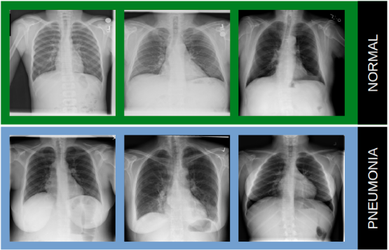

# Radiography Pneumonia Detection 

In this project we compared the training performances and results of various machine learning algorithm on the task of pneumonia detection on radiographies.

See [the full report](ZoidbergReport.pdf) for details.